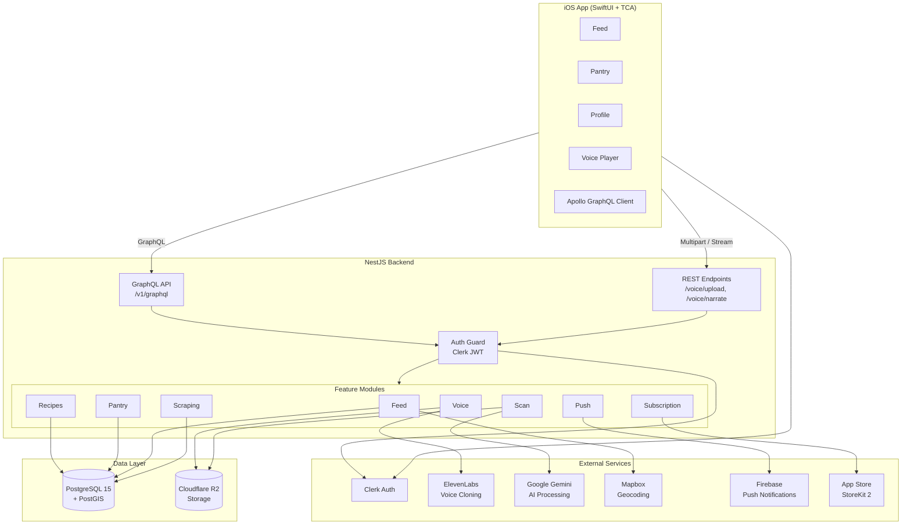
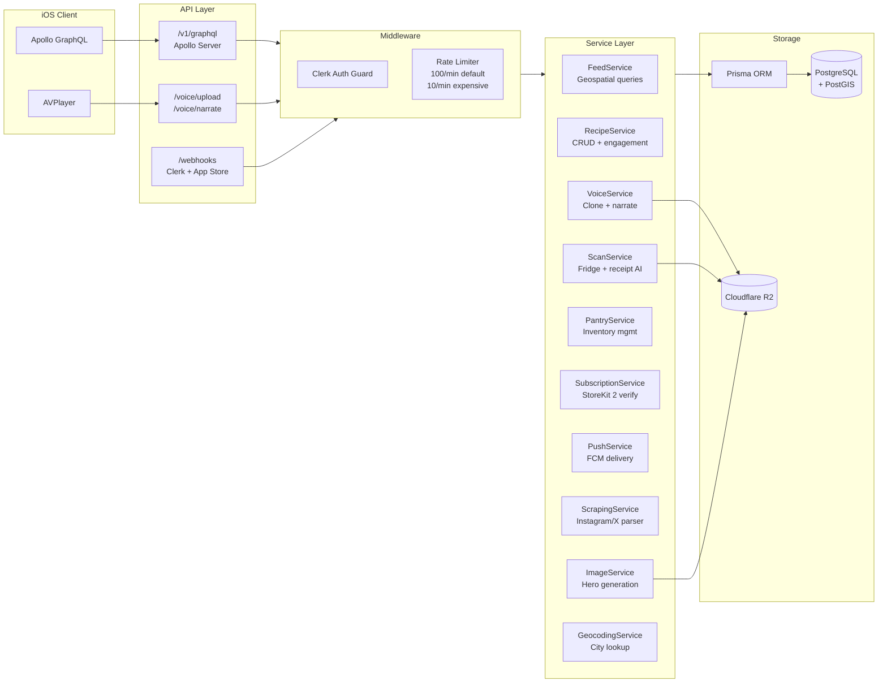
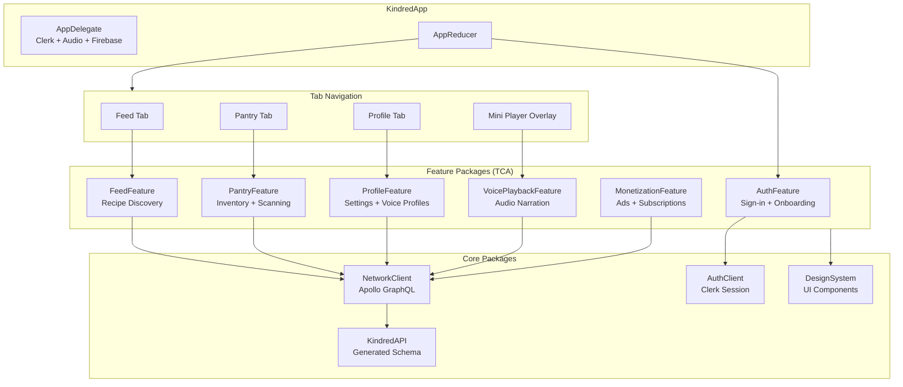

# Kindred

A social cooking app where AI-cloned voices narrate recipes from loved ones. Built with SwiftUI + TCA for iOS and NestJS + GraphQL for the backend.

## Architecture

### System Overview



### Backend Architecture



### iOS App Architecture



### iOS App (`Kindred/`)

Built with **SwiftUI**, **The Composable Architecture (TCA)**, and a modular **Swift Package Manager** structure targeting **iOS 17.0+**.

| Package | Description |
|---------|-------------|
| **AuthFeature** | Sign-in with Apple via Clerk, onboarding flow (dietary prefs, location) |
| **AuthClient** | Clerk authentication client with session management |
| **FeedFeature** | Recipe feed with location-based filtering, dietary chips, engagement metrics |
| **PantryFeature** | Pantry inventory management, barcode/fridge scanning, expiry tracking |
| **ProfileFeature** | User profile, dietary preferences, subscription status, voice profiles |
| **VoicePlaybackFeature** | Audio playback engine for AI-cloned voice narration with AVPlayer |
| **MonetizationFeature** | Google Mobile Ads integration, UMP consent, StoreKit 2 subscriptions |
| **NetworkClient** | Apollo GraphQL client with caching and dependency injection |
| **KindredAPI** | Apollo-generated GraphQL schema types |
| **DesignSystem** | Shared UI components, typography, colors, haptics |

### Backend (`backend/`)

**NestJS 11** with **Apollo GraphQL**, **Prisma ORM**, and **PostgreSQL 15 + PostGIS**.

| Module | Description |
|--------|-------------|
| **auth** | Clerk webhook integration, JWT guards |
| **users** | User profile management |
| **recipes** | Recipe CRUD, search, engagement (likes, bookmarks) |
| **feed** | Feed algorithm with geospatial queries, dietary filtering |
| **pantry** | Pantry items, expiry tracking, storage locations |
| **voice** | AI voice cloning (ElevenLabs), narration generation/caching |
| **scan** | OCR for receipts/fridge scans, AI item detection (Gemini) |
| **images** | Hero image generation via Gemini, Cloudflare R2 storage |
| **subscription** | StoreKit 2 validation, App Store Server Notifications |
| **scraping** | Instagram/X recipe scraping and parsing |
| **geocoding** | Mapbox integration, city-level caching |
| **push** | Firebase push notifications with rate limiting |
| **privacy** | GDPR compliance, data export |

### Database Models

- **User & Auth** — User, DeviceToken
- **Recipes** — Recipe (with geospatial lat/lon), Ingredient, RecipeStep, Bookmark
- **Pantry** — PantryItem, ScanJob, IngredientCatalog
- **Voice** — VoiceProfile, NarrationScript, NarrationAudio
- **Subscriptions** — Subscription, TransactionHistory
- **Notifications** — NotificationPreferences, NotificationLog
- **Geo** — CityLocation (geocoding cache)

## Tech Stack

| Layer | Technology |
|-------|-----------|
| iOS | SwiftUI, TCA, Swift 5.10 |
| Backend | NestJS 11, Apollo GraphQL, TypeScript |
| Database | PostgreSQL 15 + PostGIS |
| ORM | Prisma 7 |
| Auth | Clerk (iOS SDK + Backend SDK) |
| AI | Google Gemini (recipe parsing, narration rewriting) |
| Voice | ElevenLabs (voice cloning + TTS) |
| Storage | Cloudflare R2 |
| Push | Firebase Cloud Messaging |
| Geocoding | Mapbox |
| Monetization | Google Mobile Ads, StoreKit 2 |
| CI/CD | GitHub Actions → Hetzner (Docker) |

## Development

### Prerequisites

- Xcode 16+ (iOS 17.0 target)
- Node.js 20+
- Docker & Docker Compose
- PostgreSQL 15 with PostGIS

### Backend Setup

```bash
cd backend
npm install
npx prisma generate
npx prisma migrate dev

# Start with Docker
docker compose up -d

# Or run directly
npm run start:dev
```

### iOS Setup

Open `Kindred/Kindred.xcodeproj` in Xcode. Swift packages resolve automatically.

### Environment Variables

Backend requires a `.env` file with:

```
DATABASE_URL=postgresql://...
CLERK_SECRET_KEY=...
CLERK_PUBLISHABLE_KEY=...
CLERK_WEBHOOK_SECRET=...
ELEVENLABS_API_KEY=...
GEMINI_API_KEY=...
CLOUDFLARE_R2_ACCESS_KEY=...
CLOUDFLARE_R2_SECRET_KEY=...
CLOUDFLARE_R2_BUCKET=...
CLOUDFLARE_R2_ENDPOINT=...
MAPBOX_ACCESS_TOKEN=...
FIREBASE_PROJECT_ID=...
APPLE_BUNDLE_ID=...
APPLE_APP_ID=...
APPLE_ALLOWED_PRODUCT_IDS=...
```

## CI/CD

GitHub Actions pipeline with two workflows:

- **CI** (`ci.yml`) — Runs on all pushes: lint, typecheck, build, Docker image verification
- **Deploy** (`deploy.yml`) — Runs on push to `main`: SSH to Hetzner server, pull, build, migrate, restart, health check

Deployment target: `api.kindredcook.app`

## API

GraphQL endpoint: `POST /v1/graphql`

Health check:
```bash
curl -X POST https://api.kindredcook.app/v1/graphql \
  -H 'Content-Type: application/json' \
  -d '{"query":"{ health }"}'
```

Voice upload (REST): `POST /voice/upload` (multipart form-data)

Narration streaming (REST): `GET /voice/narrate/:recipeId/:voiceProfileId`

## License

Private — All rights reserved.
